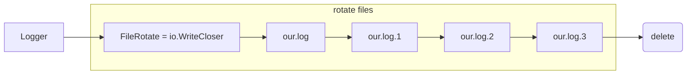

# filerotate

Rotates [log] files generated by any kind of [logger] that is capable to use io.Writer in golang.
Implements io.WriteCloser interface.



## Configuration
```golang
// Options
type Options struct {
  // FilePath full path to the log file (i.e our.log)
  FilePath string
  // Rotate log file count times before removing. If Rotate count is 0, old versions are removed rather than rotated, so that only our.log is present
  Rotate int
  // Size of the file to grow. When exceeded, file is rotated.
  Size uint64
  // File mode, like 0600
  Mode os.FileMode
  // LineSeparator is the separator for the rotated files content
  // If specified, rotated files will be split only when the separator is found in the
  // content of the file.
  LineSeparator []byte
}

// there are predefined line separators, but you can use your own
var (
  LineSeparatorUnix    = []byte("\n")
  LineSeparatorWindows = []byte("\r\n")
  LineSeparatorMac     = []byte("\r")
  LineSeparatorNothing = []byte{}
)

```
## Binary vs Text 

filerotate is not limited to text files and can handle writing binary files, rotated by size or size + line separator, that can be any sequence of bytes specified, not limited to "\n", "\r\n" or "\r". 
Splitting the files does not happen at exaclty `Options.Size` byte and depends on the size of the buffer provided to `io.Writer.Write(buf)`, so that binary files may get corrupted.

## Usage

```golang
package main

import (
	"log"
	"github.com/illarion/filerotate"
)

func main() {
    // Create a new file rotate
    fr, err := filerotate.New(filerotate.Options{
        FilePath: "our.log",
        Rotate:   3,
        Size:     1024,
        Mode:     0600,
        LineSeparator: filerotate.LineSeparatorUnix,
    })
    
    if err != nil {
        log.Fatal(err)
    }
   
    // Connect log to the rotating writer
    log.SetOutput(fr)

    // Write to log number of times
    for i := 0; i < 10000; i++ {
        log.Printf("Hello, world %d\n", i)
    }
}
```

after runing the code, you will see the following files in the director

```log
~# go run main.go

~# ls -1
our.log
our.log.1
our.log.2
our.log.3
```

## License
MIT (see [LICENSE](LICENSE))
