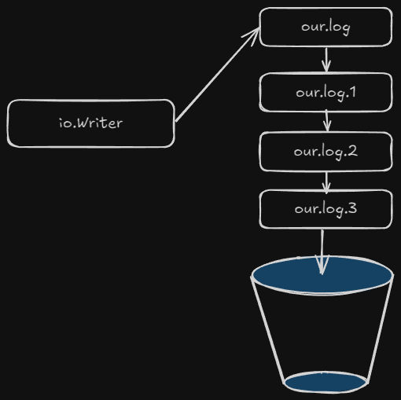

# filerotate
Rotates [log] files generated by any kind of logger that is capable to use Writer in golang



## Configuration
```golang
// Options
type Options struct {
  // FilePath full path to the log file (i.e our.log)
  FilePath string
  // Rotate log file count times before removing. If Rotate count is 0, old versions are removed rather than rotated, so that only our.log is present
  Rotate int
  // Size of the file to grow. When exceeded, file is rotated.
  Size uint64
  // File mode, like 0600
  Mode os.FileMode
}
```

## Usage

```golang
TODO
```
